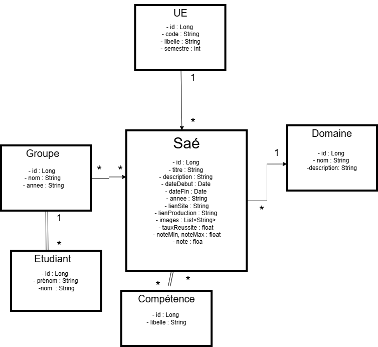

# AppSAE — Banque de SAé MMI

## Vue d'ensemble



**AppSAE** est une application mobile complète développée sous React Native (Expo) pour centraliser et consulter l'ensemble des SAé (Situations d'Apprentissage et d'Évaluation) réalisées par les promotions MMI2 et MMI3 de l'IUT MLV — Site de Meaux.

L'application sert de banque de données officielle pour les festivals MMI, de source documentaire pour les étudiants, et de vitrine pour les Journées Portes Ouvertes. Elle permet de consulter toutes les SAé par promotion, domaine ou note, et d'ajouter de nouvelles SAé via un espace administrateur sécurisé.

---

## Fonctionnalités

### Espace Public

- **Page d'accueil** — Vue d'ensemble avec statistiques globales (total SAé, groupes, domaines) et accès rapide.
- **SAé par promotion** — Navigation caroussel entre MMI2 et MMI3 avec filtres par domaine (Web, DI, 3D, Création, Développement).
- **SAé par domaine** — Parcours thématique regroupant les SAé par domaine avec code couleur.
- **Groupes MMI2 / MMI3** — Vue dédiée par année avec notes affichées par groupe (moyenne, min, max, notes individuelles) en grille 2×2.
- **Galerie d'images** — Carousel d'illustrations pour chaque réalisation de groupe.
- **Détail SAé** — Informations complètes : compétences, semestre, UE, dates, ressources humaines, liens site et code source.

### Espace Administrateur (JWT requis)

- **Dashboard tabbed** — Interface à 4 onglets pour gérer SAé, Projets groupes, Groupes et UE.
- **Création SAé** — Formulaire complet avec titre, description, domaine, semestre, dates, UE liée.
- **Création SaeProject** — Ajout d'un projet groupe avec notes individuelles des élèves, images (URLs), liens.
- **Gestion Groupes / UE** — Création des entités référentielles.

---

## Technologies Utilisées

### Frontend Mobile

| Technologie               | Usage                                                                                  |
| ------------------------- | -------------------------------------------------------------------------------------- |
| React Native 0.81         | Framework mobile cross-platform                                                        |
| Expo SDK 54               | Toolchain, build et distribution                                                       |
| Expo Router v6            | Navigation file-based (Stack + Tabs)                                                   |
| TypeScript 5.9            | Typage statique                                                                        |
| Design System custom      | Composants UI (Card, Button, Screen, TextField) + tokens (colors, typography, spacing) |
| GSAP 3                    | Animations (splash screen)                                                             |
| React Native Reanimated 4 | Animations déclaratives                                                                |

### Backend

| Technologie                       | Usage                                             |
| --------------------------------- | ------------------------------------------------- |
| Spring Boot 4.0 (Java 21)         | Framework API REST                                |
| Spring Security + JWT (JJWT 0.11) | Authentification stateless, contrôle d'accès RBAC |
| Spring Data JPA + Hibernate       | ORM et accès base de données                      |
| Lombok                            | Réduction du boilerplate Java                     |
| MySQL Connector/J                 | Driver base de données                            |
| Maven                             | Gestion des dépendances et build                  |

### Infrastructure & Hébergement

| Service                                     | Rôle                                                 |
| ------------------------------------------- | ---------------------------------------------------- |
| MySQL 8.0                                   | Base de données principale (données structurées)     |
| Stockage externe (Cloudinary ou équivalent) | Hébergement des images (URLs référencées en BD)      |
| Docker + Docker Compose                     | Conteneurisation du backend et de la base de données |

---

## Structure du Projet

```
AppSAE/
├── appsae/                              # Backend Spring Boot
│   ├── src/main/java/mmi/sae/appsae/
│   │   ├── config/
│   │   │   ├── SecurityConfig.java      # Spring Security + CORS + JWT filter chain
│   │   │   └── AdminUserInitializer.java # Création du compte admin au démarrage
│   │   ├── domain/
│   │   │   ├── Ue.java                  # Entité UE (code, nom)
│   │   │   ├── Groupe.java              # Entité Groupe (nom, année MMI2/3)
│   │   │   ├── Sae.java                 # Entité SAé (sujet : titre, domaine, semestre, UE)
│   │   │   ├── SaeProject.java          # Instance SAé par groupe (notes, images, liens)
│   │   │   └── AdminUser.java           # Compte administrateur
│   │   ├── repository/                  # Interfaces Spring Data JPA
│   │   ├── security/
│   │   │   ├── JwtTokenService.java
│   │   │   └── JwtAuthenticationFilter.java
│   │   ├── service/
│   │   │   └── AdminUserDetailsService.java
│   │   └── web/
│   │       ├── AuthController.java      # POST /api/auth/login
│   │       ├── UeController.java        # GET|POST /api/ue
│   │       ├── GroupeController.java    # GET|POST /api/groupe
│   │       ├── SaeController.java       # GET|POST /api/sae
│   │       ├── SaeProjectController.java # GET|POST /api/sae-project
│   │       └── dto/                     # Request / Response DTOs
│   ├── Dockerfile                       # Multi-stage Maven → JRE slim
│   └── pom.xml
│
├── AppSAE-front/                        # Frontend React Native / Expo
│   ├── app/
│   │   ├── _layout.tsx                  # Root layout (Stack + splash)
│   │   ├── index.tsx                    # Redirect vers (tabs)/home
│   │   ├── (tabs)/
│   │   │   ├── _layout.tsx              # Tab bar (home, projects, mmi2, mmi3, domains)
│   │   │   ├── home.tsx                 # Accueil + stats
│   │   │   ├── projects.tsx             # SAé avec filtres + carousels MMI2/MMI3
│   │   │   ├── mmi2.tsx                 # Projets MMI2 avec notes par groupe
│   │   │   ├── mmi3.tsx                 # Projets MMI3 avec notes par groupe
│   │   │   └── domains.tsx              # SAé groupées par domaine
│   │   ├── sae/[id].tsx                 # Détail SAé → grille 2×2 des groupes
│   │   ├── project/[id].tsx             # Détail SaeProject (galerie, notes, liens)
│   │   └── admin/
│   │       ├── login.tsx                # Authentification admin
│   │       └── dashboard.tsx            # Dashboard tabbed (SAé / Projet / Groupe / UE)
│   ├── components/
│   │   ├── ui/                          # Design system (Card, Button, Screen, TextField)
│   │   └── projects/
│   │       ├── SaeCard.tsx              # Card carousel pour une SAé
│   │       ├── GroupeCard.tsx           # Card grille pour un groupe (avec notes)
│   │       ├── ProjectCard.tsx          # Card liste générique
│   │       └── api.ts                   # Tous les appels API centralisés
│   ├── theme/                           # Tokens (colors, typography, spacing, radius)
│   ├── constants/api.ts                 # baseURL configurable via EXPO_PUBLIC_API_BASE_URL
│   └── assets/
│
└── docker-compose.yml                   # MySQL 8 + Spring Boot back
```

---

## Installation

### Prérequis

- Java JDK 21
- Maven (ou utiliser `./mvnw`)
- Docker + Docker Compose
- Node.js v18+ + npm
- Expo CLI (`npm install -g expo-cli`)

### 1. Lancement du Backend

> **Important — Utilisation sur téléphone physique :** Docker ne fonctionne pas pour les tests sur téléphone réel car le backend tourne sur `localhost` de la machine hôte, inaccessible depuis un appareil mobile sur le réseau. Il faut lancer le backend manuellement et configurer l'URL avec l'IP locale de la machine.

#### Option A — Lancement manuel (requis pour téléphone physique)

```bash
cd appsae
./mvnw spring-boot:run
```

Le backend démarre sur `http://<IP_LOCALE>:8080/api`.

Trouvez votre IP locale :

- macOS/Linux : `ifconfig | grep "inet " | grep -v 127`
- Windows : `ipconfig`

Puis configurez le frontend (voir étape 2).

#### Option B — Docker (émulateur uniquement)

```bash
docker compose up -d
```

Services démarrés :

- **MySQL 8** sur le port `3307` (local) → `3306` (container)
- **Spring Boot** sur le port `8080`

Un compte administrateur par défaut est créé automatiquement :

- **Login :** `admin` — **Mot de passe :** `admin`

L'API est disponible sur `http://localhost:8080/api`.

### 2. Configuration Frontend

Créez `AppSAE-front/.env.local` :

```env
# Emulateur (Docker ou lancement local)
EXPO_PUBLIC_API_BASE_URL=http://localhost:8080/api

# Téléphone physique — remplacer par votre IP locale
EXPO_PUBLIC_API_BASE_URL=http://192.168.x.x:8080/api
```

### 3. Lancement du Frontend

```bash
cd AppSAE-front
npm install
npx expo start
```

Scannez le QR code avec l'app Expo Go sur votre téléphone, ou appuyez sur `i` (iOS simulator) / `a` (Android emulator).

---

## API — Principaux Endpoints

### Public (sans authentification)

| Méthode | Endpoint                                      | Description                                   |
| ------- | --------------------------------------------- | --------------------------------------------- |
| `POST`  | `/api/auth/login`                             | Connexion admin, retourne un JWT              |
| `GET`   | `/api/sae/public/all`                         | Toutes les SAé (sujets)                       |
| `GET`   | `/api/sae/public/{id}`                        | Détail d'une SAé                              |
| `GET`   | `/api/sae/public/{id}/projects`               | Projets groupes liés à une SAé                |
| `GET`   | `/api/sae/public/by-domain?domain=Web`        | SAé filtrées par domaine                      |
| `GET`   | `/api/sae-project/public/by-year?year=MMI3`   | SaeProjects par année (avec notes)            |
| `GET`   | `/api/sae-project/public/by-domain?domain=DI` | SaeProjects par domaine                       |
| `GET`   | `/api/sae-project/public/{id}`                | Détail d'un SaeProject (avec moyenne/min/max) |
| `GET`   | `/api/groupe/public/all`                      | Tous les groupes                              |
| `GET`   | `/api/groupe/public/by-year?year=MMI2`        | Groupes par année                             |
| `GET`   | `/api/ue/public/all`                          | Toutes les UE                                 |

### Admin uniquement (JWT requis)

| Méthode | Endpoint                 | Description                       |
| ------- | ------------------------ | --------------------------------- |
| `POST`  | `/api/sae/admin`         | Créer une SAé                     |
| `POST`  | `/api/sae-project/admin` | Créer un projet groupe avec notes |
| `POST`  | `/api/groupe/admin`      | Créer un groupe                   |
| `POST`  | `/api/ue/admin`          | Créer une UE                      |

## Espace Administrateur

### Accès à la page admin

La page de connexion admin n'est pas accessible via un lien visible. Pour y accéder :

1. Lancer l'application et aller sur la page **Accueil**
2. Faire un **appui long (≥ 0,6 s) sur le bouton MMI** en haut à droite de l'écran
3. La page de connexion s'ouvre

### Identifiants par défaut

| Champ            | Valeur  |
| ---------------- | ------- |
| **Identifiant**  | `admin` |
| **Mot de passe** | `admin` |

> Ces identifiants sont créés automatiquement au démarrage du backend via `AdminUserInitializer.java`. Ils peuvent être modifiés dans ce fichier avant le lancement.

---

## Contexte du Projet

Ce projet a été réalisé dans le cadre du **TP Noté R6.03 — Développement Mobile** de la licence BUT MMI (Métiers du Multimédia et de l'Internet), 3ème année, IUT MLV — Site de Meaux.

### Objectif pédagogique

Concevoir et déployer une application mobile complète en binôme, intégrant un back-end Spring Boot et une API REST consommée par une application React Native.

### Équipe

| Membre                   | Rôle                                                                                    |
| ------------------------ | --------------------------------------------------------------------------------------- |
| **Aathavan THEVAKUMAR**  | Lead développeur — Backend Spring Boot, Architecture API, Docker, Frontend React Native |
| **Trystan Kecket-Baker** | Co-développeur — Frontend React Native, Design system, Intégration API                  |

---

## Liens Utiles

- **Frontend React Native :** `AppSAE-front/`
- **API Backend :** `appsae/` — `http://localhost:8080/api`
- **Docker :** `docker compose up -d`

---

_Projet académique — BUT MMI 3ème année — R6.03 Développement Mobile — IUT MLV, Site de Meaux — 2025/2026_
